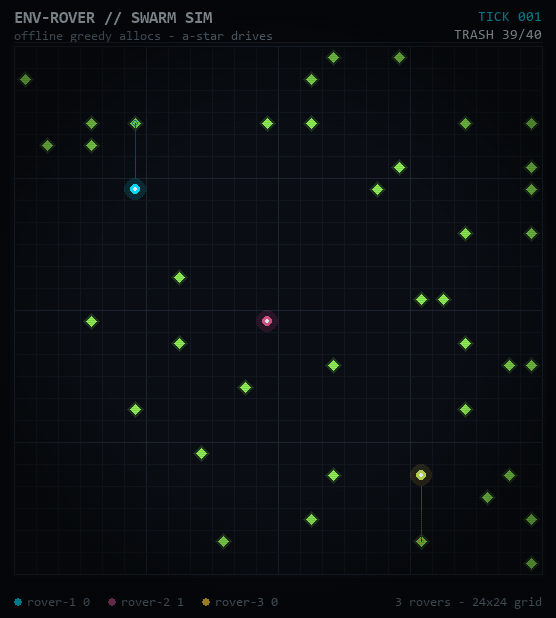

# env-rover

three autonomous rovers, one dirty grid, zero humans needed. this is the simulation backend for a swarm of trash-collecting rovers — the kind that will one day roll down real roads scooping up the plastic nobody should have to pick up by hand.

the whole thing runs on a split brain:

- **gemini 3.8 flash** is mission control. it stares at the board and decides who goes where — pure task allocation, one async json call per round, nothing else.
- **a-star + manhattan distance** is the driver. once a rover gets its target, classic pathfinding walks it there step by step. no tokens burned on steering.

the llm never touches the wheel. the math never gets creative. each covers the other's weakness and the swarm just cleans.

i started this after a road trip from konkan to mumbai — kilometers of plastic along the shoulder, over and over. that image never left. tech isn't the opposite of nature, it's the tool that gives nature its space back. env-rover is me building toward that, one tick at a time.

**status: currently building the python sim backend, hardware integration comes later.**

## how it works (under the hood)

```
   gemini 3.8 flash                    a-star + manhattan
   task allocator        ->            steering
   (who goes after what)               (how to actually get there)
```

every tick, three things happen:

1. **allocate** — rovers with no valid target ping the allocator. gemini sees every rover position plus every trash coordinate and replies with json assigning exactly one trash tile to each rover. async, so no rover ever blocks another.
2. **drive** — each rover runs a-star (heapq open set, manhattan heuristic, 4 directions) to its assigned target and takes one step down that path per tick. trash tiles are walkable, only the grid walls aren't.
3. **scoop** — stand on trash and it's gone. if another rover grabs your target mid-drive, your target dies and the next allocation round hands you a new one.

why split it like this: llm calls are slow and cost money but they're good at judgment. a-star is instant and free but has zero judgment. one gemini call allocates for the whole swarm, then the math drives until the world changes. and when gemini throttles, hallucinates a coordinate that isn't even on the trash list, or wraps its json in markdown fences for no reason — a greedy nearest-unclaimed-trash allocator takes over and the swarm never stalls. the fallback is also the benchmark: if the llm can't out-allocate a 15-line greedy function, it hasn't earned its tokens yet.

### repo layout

```
core/llm_brain.py          gemini 3.8 flash task allocator, async, json + greedy fallback
core/swarm_async.py        SwarmSim engine: allocate -> drive -> scoop, every tick
simulation/grid_env.py     numpy grid world, manhattan, a-star, trash, walls
simulation/visualizer.py   pygame renderer, retro-hacker terminal aesthetic
generate_gif.py            runs the swarm headless and records assets/demo.gif
tests/test_sim.py          46 checks, zero network needed
```

### roadmap, honest version

done:
- neuro-symbolic split: gemini allocates, a-star drives
- 3-rover async swarm, full board cleans in ~70 ticks
- pygame visualizer + auto-generated demo gif
- a-star verified optimal against a bfs reference on 30 random cases

in progress:
- allocator prompt tuning, gemini still makes the occasional lazy pick
- benchmarks: llm vs greedy allocation over many seeded runs

later, much later:
- rover-rover collision awareness (they can share a tile rn)
- bigger grids, partial observability, comm delays
- hardware. real motors. real trash.

## how to run locally

needs python 3.10+.

```
pip install -r requirements.txt
cp .env.example .env    # paste your GOOGLE_API_KEY in
```

headless sim in the terminal:

```
python core/swarm_async.py
```

pygame window with the full visual stack:

```
python simulation/visualizer.py
```

regenerate the demo gif (100 frames, fixed seed, fully reproducible):

```
python generate_gif.py
```

run the test suite:

```
python tests/test_sim.py
```

no api key? everything still runs — the greedy allocator covers it, so the swarm moves whether or not gemini shows up.

## the game

before the python pivot there was a playable 3d web game — first-person rover, waste collection, 5 levels. it still lives at [envroverimplemento.netlify.app](https://envroverimplemento.netlify.app) and the full source is in `envroverimplemento/` (index.html + game.js, three.js, zero build step). beat all 5 levels and it hands you a pdf certificate of environmental awareness, jsPDF-generated in the browser. fixed the cert render (the title and footer used to punch through the borders and the score line printed on top of the body text).

## assets

- `assets/demo.gif` — the run above, auto-captured from the actual sim
- `assets/envrover_model_1.0.png` — 1.0 design render
- `assets/ENV-ROVER_Technical_Doc.pdf` — original concept doc
- `assets/IMG_0186.PNG`, `assets/3dMODEL-env-rover-1.0-rough.zip` — early tinkercad model

progress log: `WORK-LOGS/whatididanddoing.md`