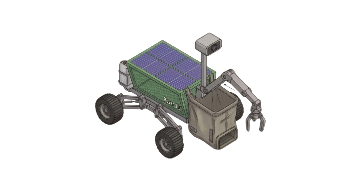

# env-rover

<p align="center">
  
</p>

llm-directed swarm robotics. the end goal is a fleet of autonomous rovers that clean up roadside waste, and this repo is the simulation backend where the swarm logic gets proven before any hardware exists. **currently building the python sim backend, hardware integration comes later.**

repo status: work in progress. the sim runs, the architecture is still moving, do not expect polish.

## what this actually does

3 rovers drop onto a 24x24 grid with 40 pieces of randomly spawned trash. every tick, each rover sends its own position + the nearest trash coordinates to gemini and asks for one move: UP, DOWN, LEFT or RIGHT. the llm is the navigation brain, the rovers are just bodies. the moves are wall-bounded (nothing clips out of the grid) and standing on trash scoops it.

if the api call dies, rate limits, or the model replies with something that isn't valid json, a greedy toward-nearest-trash policy takes over for that tick so the sim never stalls. it runs fine with no api key at all.

## current simulation architecture

```
core/swarm_async.py          the boss. 3 rover loops running on asyncio.gather
        |
        v
core/llm_brain.py            builds the prompt, calls gemini, parses the json
        |                    (falls back to greedy when the api dies or lies)
        v
simulation/grid_env.py       world state: trash coords, rover positions, walls
        |
        v
gemini api  (gemini-2.5-flash default, override with GEMINI_MODEL)
```

- `simulation/grid_env.py` — numpy grid world. trash lives in an (N,2) coord array so sensor queries are one vectorized hypot instead of scanning a full 2d map. spawn is brute-force rerolls with a guard cap, movement is wall-bounded, ascii render for terminal debugging.
- `core/llm_brain.py` — async gemini wrapper. system prompt asks for a single move as json, and the parser tolerates markdown fences, non-dict json and illegal moves without ever breaking the tick loop.
- `core/swarm_async.py` — 3 concurrent rover loops, one llm round-trip per rover per tick, all in flight at once. no locks anywhere: every shared-state mutation happens synchronously between awaits, and asyncio is single threaded, so the grid can't corrupt mid-mutation.
- `tests/test_sim.py` — offline test suite: grid bounds, parser edge cases, fallback behavior, and a full swarm run against a fake api client. no network needed.

why the greedy fallback exists: llm latency is the whole problem. one bad call per tick across 3 rovers adds up fast, and the fallback also gives a baseline to beat — if the llm can't out-clean a 20-line greedy function, the brain isn't worth its tokens yet.

## how to run it

needs python 3.10+.

```
pip install -r requirements.txt
cp .env.example .env    # then put your GOOGLE_API_KEY in there
python core/swarm_async.py
```

no key? it still runs in offline mode and every decision goes through the greedy policy, so you can watch the swarm move without spending api credits.

run the test suite:

```
python tests/test_sim.py
```

## roadmap, honest version

done:
- grid world with trash spawning, sensor radius, collection
- gemini brain with json parsing and greedy fallback on every failure path
- 3-rover async swarm, verified concurrent with a fake api client

in progress:
- prompt tuning, the model still hugs walls way more than it should
- benchmarking: ticks-per-trash and stalls per rover, llm vs greedy baseline

later, much later:
- rover-rover coordination, right now they can chase the same trash
- path memory so rovers stop re-deciding tiles they already swept
- hardware integration, only after the sim actually beats the greedy baseline

## assets

- `assets/envrover_model_1.0.png` — 1.0 design render
- `assets/ENV-ROVER_Technical_Doc.pdf` — original concept doc
- `assets/IMG_0186.PNG`, `assets/3dMODEL-env-rover-1.0-rough.zip` — early tinkercad model

progress log: `WORK-LOGS/whatididanddoing.md`